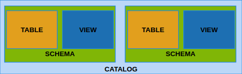

% SQL (Ch 4)
% Dr. Andrew Besmer

# SQL

## DBMS vs Relational

* **Table**, **row**, and **column** instead of relation, tuple, and attribute
	* Lot's of people will still use these interchangeably

\ 

| Relational Model |  DBMS  |
| :--------------: | :----: |
| Relation         | Table  |
| Tuple            | Row    |
| Attribute        | Column |


##  Schema

SQL Schema
:   A set of statements used to define of all elements in the database. Each statement terminates with a `;`

\ 

* We can specify data definitions or schema's using the `CREATE` command
* Elements include:
	* Tables
	* Constraints
	* Views
	* Domains

\ 

```sql
CREATE DATABASE my_besmera2;

CREATE TABLE Product (
	name VARCHAR(255)
);
```

## Catalog

Catalog
:   A named collection of schemas




